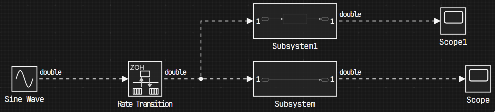

# Simulink Web View Customizer

A Python-based tool to customize the appearance of Simulink-generated web views by injecting custom styles and assets.

Live Demo: [Default Dark Mode]() | [Default Ligh Mode]()

## Overview

The purpose of this repo (another useless project :3) is to be able to customize the Simulink generated web view, it was a bit of a hustle to separate everything and to make it easier to customize since MATLAB is using the [Dijit UI Library](https://dojotoolkit.org/reference-guide/1.10/dijit/index.html) from [Dojo Toolkit](https://dojotoolkit.org/), specifically, the [Claro theme](https://download.dojotoolkit.org/release-1.5.0/dojo-release-1.5.0/dijit/themes/themeTester.html?theme=claro), but it is here.

## Installation

1. Copy the following folders and files to your project's root directory:

    - `themes/`
    - `utils/`
    - `main.py`
    - `ui_config.json`

2. Install the required Python dependencies:

```bash
pip install -r requirements.txt
```

## Usage

1. Ensure you have generated a Simulink web view for your model
2. Run the customization script:

```bash
python main.py
```

## Configuration

The `ui.config.json` file allows you to customize various aspects of the web view:

### HTML Settings

```json
{
    "html": {
        // Name of the HTML file to modify
        "filename": "webview.html",
        // Browser tab title
        "title": "Your Custom Title",
        // Custom favicon
        "favicon": "favicon.ico",
        // Theme to apply
        "theme": "themes/default-dark-theme/style.css"
    }
}
```

### SVG Diagram Settings



```json
{
    "svg": {
        // Directory containing SVG files
        "path": "support/slwebview_files",
        "diagram": {
            // Enable/disable diagram background
            "enableBackground": false,
            // Custom font for diagram text
            "fontFamily": "JetBrains Mono"
        },
        "blocks": {
            // Original block background color to be replaced
            "oldBackgroundColor": "#ffffff",
            // New block background color
            "backgroundColor": "#262626CC",
            // Original primary text color to be replaced
            "oldForegroundPrimaryColor": "#000000",
            // New primary text color
            "foregroundPrimaryColor": "#f5f5f5",
            // Original secondary text color to be replaced (Can be an array)
            "oldForegroundSecondaryColor": ["#e4e4e4", "#ababab"],
            // New secondary text color
            "foregroundSecondaryColor": "#cecece",
            // Use block images (it is recommended not to use them because of the poor quality)
            "useImages": false,
            // Use gradient backgrounds (The gradient used in subsystems and other blocks)
            "useGradients": false
        },
        "connections": {
            // Use dashed connection lines
            "useDashedLines": false,
            // Animate connection lines
            "useAnimations": false
        }
    }
}
```

## Project Structure

```text
├── themes/        # Custom CSS themes and styles
├── utils/         # Utility functions for file manipulation
├── main.py        # Main script to run the customization
└── ui_config.json # Configuration file for UI customization
```

## Components

The following components can be styled using their respective classnames:

### Core UI Components

-   `.dijitSplitter`: Handles the resizable split panels in the interface
-   `.dijitTooltip`: Displays hover tooltips and hints
-   `.dijitScrollbar`: Custom scrollbar styling for all panels

### Model Components

-   `.ModelBrowser`: Left sidebar containing model hierarchy and navigation
-   `.ModelViewer`: Main area displaying the Simulink diagram
-   `.ModelInspector`: Right sidebar showing block properties and parameters
-   `.PaletteWidget`: Library browser for Simulink blocks
-   `.SearchResults`: Search interface and results display

### Design Elements

-   `.DesignSystem`: Core design tokens and variables
-   `.Icons`: Custom SVG icons and visual elements
-   `.PopupMenu`: Context and dropdown menus
-   `.GlobalOverrides`: Global style overrides for the Dijit framework

Each component is modular and can be customized independently in the theme files.

## Features

-   Custom CSS injection
-   Diagrams SVGs Cleaning (Removing low resolution images, and gradients if necessary)
-   Icon replacement (Using high quality svg icons, instead of the stock old icons)
-   Added flow animation to blocks connections

## TO-DO

-   [ ] Modular system
-   [ ] GUI App
-   [ ] Build a full web app generator (Maybe... Since the approach used here is full of hard coded elements, it is possible to leverage the file inside `support/slwebview_files` to build a new web app based on that, since it contains all the necessary components.)

## Contributing

Feel free to submit issues, fork the repository, and create pull requests for any improvements.
