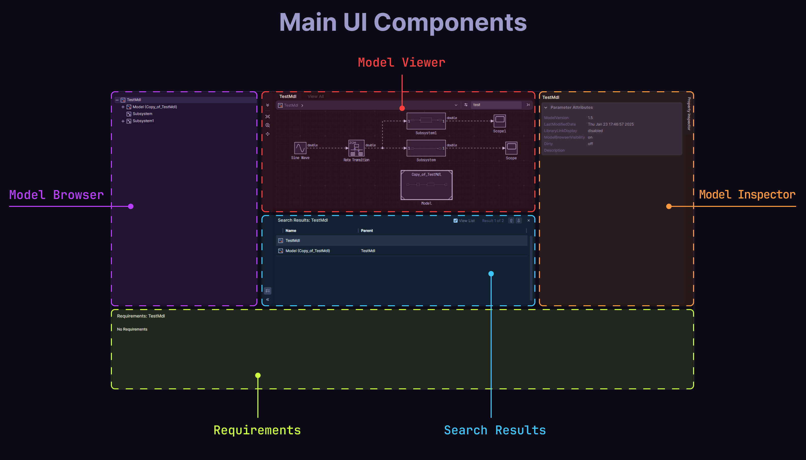

# Simulink Web View Customizer


A Python-based tool to customize the appearance of Simulink-generated web views by injecting custom styles and assets.

Live Demo: [Demo](https://aalaedev.github.io/Simulink-Web-View-Customizer/demo/)

## Overview

The purpose of this repo (another useless project :3) is to be able to customize the Simulink generated web view, it was a bit of a hustle to separate everything and to make it easier to customize since MATLAB is using the [Dijit UI Library](https://dojotoolkit.org/reference-guide/1.10/dijit/index.html) from [Dojo Toolkit](https://dojotoolkit.org/), specifically, the [Claro theme](https://download.dojotoolkit.org/release-1.5.0/dojo-release-1.5.0/dijit/themes/themeTester.html?theme=claro), but it is here.

## Installation

1. Copy the following folders and files to your project's root directory:

    - `themes/`
    - `utils/`
    - `main.py`
    - `ui_config.json`

2. Install the required Python dependencies:

```bash
pip install -r requirements.txt
```

## Usage

1. Ensure you have generated a Simulink web view for your model
2. Run the customization script:

```bash
python main.py
```

## Configuration


The `ui.config.json` file allows you to customize various aspects of the web view:

### HTML Settings

| Setting  | Description                     | Example Value                         |
| -------- | ------------------------------- | ------------------------------------- |
| filename | Name of the HTML file to modify | `webview.html`                        |
| title    | Browser tab title               | `Your Custom Title`                   |
| favicon  | Custom favicon                  | `favicon.ico`                         |
| theme    | Theme to apply                  | `themes/default-dark-theme/style.css` |

### SVG Diagram Settings

| Setting                            | Description                                            | Example Value             |
| ---------------------------------- | ------------------------------------------------------ | ------------------------- |
| path                               | Directory containing SVG files                         | `support/slwebview_files` |
| diagram.enableBackground           | Enable/disable diagram background                      | `false`                   |
| diagram.fontFamily                 | Custom font for diagram text                           | `JetBrains Mono`          |
| blocks.oldBackgroundColor          | Original block background color to be replaced         | `#ffffff`                 |
| blocks.backgroundColor             | New block background color                             | `#262626CC`               |
| blocks.oldForegroundPrimaryColor   | Original primary text color to be replaced             | `#000000`                 |
| blocks.foregroundPrimaryColor      | New primary text color                                 | `#f5f5f5`                 |
| blocks.oldForegroundSecondaryColor | Original secondary text color to be replaced           | `["#e4e4e4", "#ababab"]`  |
| blocks.foregroundSecondaryColor    | New secondary text color                               | `#cecece`                 |
| blocks.useImages                   | Use block images (not recommended due to poor quality) | `false`                   |
| blocks.useGradients                | Use gradient backgrounds                               | `false`                   |
| connections.useDashedLines         | Use dashed connection lines                            | `false`                   |
| connections.useAnimations          | Animate connection lines                               | `false`                   |

## Project Structure

```text
├── themes/        # Custom CSS themes and styles
├── utils/         # Utility functions for file manipulation
├── main.py        # Main script to run the customization
└── ui_config.json # Configuration file for UI customization
```

## Components



The following components can be styled using their respective classnames:

| Classname          | Description                                            |
| ------------------ | ------------------------------------------------------ |
| `.dijitSplitter`   | Handles the resizable split panels in the interface    |
| `.dijitTooltip`    | Displays hover tooltips and hints                      |
| `.dijitScrollbar`  | Custom scrollbar styling for all panels                |
| `.ModelBrowser`    | Left sidebar containing model hierarchy and navigation |
| `.ModelViewer`     | Main area displaying the Simulink diagram              |
| `.ModelInspector`  | Right sidebar showing block properties and parameters  |
| `.PaletteWidget`   | Library browser for Simulink blocks                    |
| `.SearchResults`   | Search interface and results display                   |
| `.DesignSystem`    | Core design tokens and variables                       |
| `.Icons`           | Custom SVG icons and visual elements                   |
| `.PopupMenu`       | Context and dropdown menus                             |
| `.GlobalOverrides` | Global style overrides for the Dijit framework         |
| `.wvInformer`      | Informer (Requirements) component                      |

Each component is modular and can be customized independently in the theme files.

## Features

-   Custom CSS injection
-   Diagrams SVGs Cleaning (Removing low resolution images, and gradients if necessary)
-   Icon replacement (Using high quality svg icons, instead of the stock old icons)
-   Added flow animation to blocks connections

## TO-DO

-   [ ] Modular system
-   [ ] GUI App
-   [ ] Build a full web app generator (Maybe... Since the approach used here is full of hard coded elements, it is possible to leverage the file inside `support/slwebview_files` to build a new web app based on that, since it contains all the necessary components.)

## Contributing

Feel free to submit issues, fork the repository, and create pull requests for any improvements.
